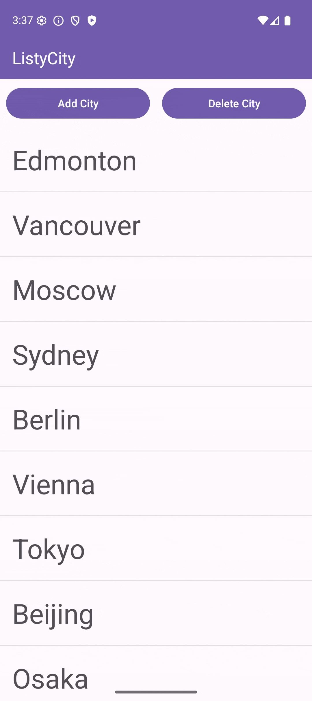

# CMPUT 301 : Lab 2 Participation Exercise

## Student Details

- **Full Name:** `Joshua Terry`
- **CCID:** `jrterry`

## References and Resources

`https://www.w3schools.com/xml/el_include.asp`
`https://developer.android.com/develop/ui/views/layout/edge-to-edge`
`https://www.geeksforgeeks.org/android/button-in-kotlin/`

## Verbal Collaboration

N/A

## Project Demo

